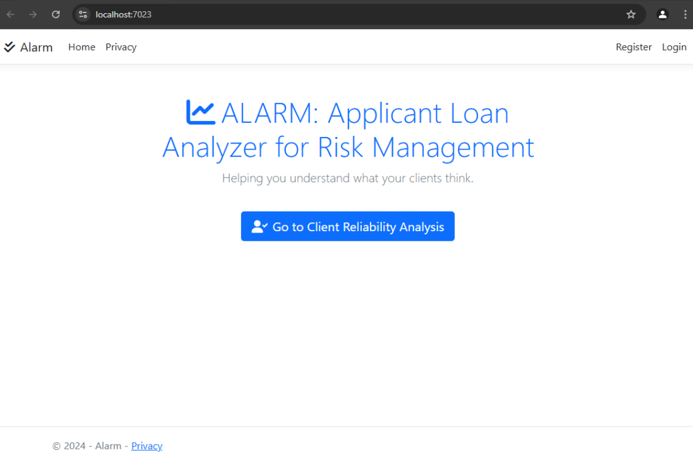
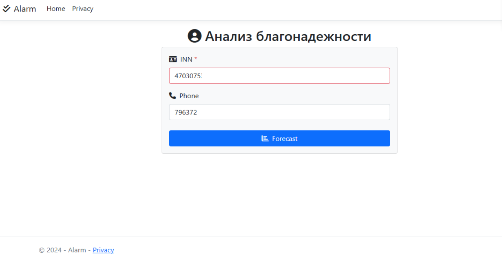
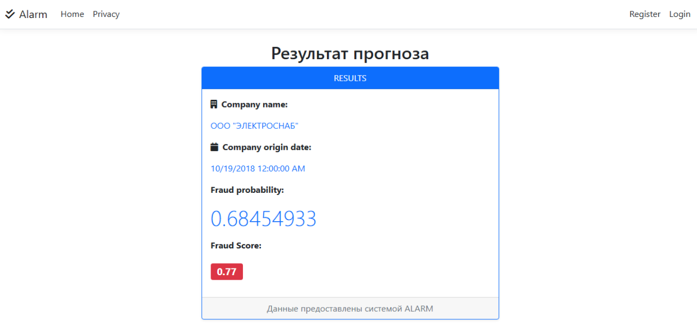
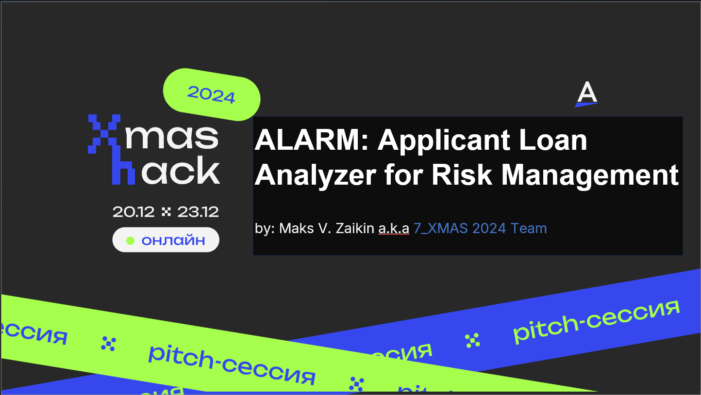

# ALARM: Applicant Loan Analyzer for Risk Management

## **History**

The creation of this project has been driven by th XMASS-Hack 2024 contest. Case#2: "Initial (Preventive) Compliance: Risk Prevention Using AI." sponsored by [Blanc Labs](https://blanclabs.com/who-we-are/) a full-service technology consulting firm.

**The Task**
Create a system that, based on the provided data about the bank's current clients, as well as additional information from open sources, social media, websites, and other company-related parameters, can predict the risk level of a new client.

## **Project Overview**
I named my solution: **ALARM system** (Applicant Loan Analyzer for Risk Management). The ALARM is a web-based application designed to predict and assess the risk level of loan applicants with the minimum initial data provided, Idealy SSN/INN. 
The ALARM system leveraging advanced machine learning models along with publicly avaliable data provided by certain public goverment services, and empowers financial institutions to make data-driven analytics in order to help minimize rirsk and make best decisions.

## **Objective**
The primary goal of the ALARM project is to provide an efficient and scalable solution for evaluating loan applications by:
- Analyzing applicant's initial data.
- Gather data from publicly available serives and make entry level check-up. How much real info has been provided, name, stock etc.
- Generating risk predictions based on pre-trained ML model on the real dataset with fraud-people features.
- Offering a user-friendly interface for inputting data and viewing predictions.
- Supporting cross-platform deployment on various operating systems.

---

## **Key Features**
- **Cross-Platform Support:** Powered by .NET Core, the application runs seamlessly on Linux, Windows, and macOS.
- **Frontend:** A responsive, interactive web interface built using React + Angular + Bootstrap for a modern user experience.
- **Backend:** An ASP.NET Core WebAPI-based REST API for data processing and model inference.
- **Machine Learning Integration:** Includes support for ML.NET or Python-based ML models wrapped as REST APIs.
- **Secure Deployment:** HTTPS configuration, and OpenAPI documentation for secure and standardized API usage.
- **Test-Driven Development:** Comprehensive backend and frontend test coverage using xUnit and Jest.

---

## **Project Components**
### **1. Frontend**
- **Technology:** React
- **Purpose:** Provides a user interface for loan officers to input applicant details and view risk analysis.
- **Key Features:**
  - Interactive forms for applicant data entry.
  - Real-time API integration for risk prediction.
  - Responsive design using Angular and Bootstrap.

### **2. Backend**
- **Technology:** ASP.NET Core 8.0
- **Purpose:** Implements REST APIs for handling data and serving predictions.
- **Key Features:**
  - Controllers for applicant data processing and ML model inference.
  - Docker support for scalable deployment.
  - Integrated Swagger/OpenAPI for API documentation.

### **3. Machine Learning (ML)**
- **Integration Options:**
  - ML.NET for in-platform model training and inference.
  - Python-based models served via REST API endpoints.
- **Purpose:** Predict the risk associated with each applicant based on pre-processed input data.

### **4. Testing**
- **Backend Testing:** xUnit for unit and integration tests.
- **Frontend Testing:** Jest and React Testing Library for component tests.

---

## **Development and Deployment Details**
### **Technology Stack**
- **Frontend:** React 18.x, Node.js 20.x
- **Backend:** .NET 8.0
- **Containerization:** *not yet included*
- **API Documentation:** OpenAPI (Swagger)
- **Database:** *not yet included*

### **Versioning**
- **React:** 18.x
- **ASP.NET Core:** 8.0
- **Docker:** Compatible with Docker Desktop 4.x
- **ML.NET:** 2.x (if applicable)
- **Node.js:** 20.x

---

## **Contributing**
Contributions are welcome to improve the ALARM system. Please follow these steps:
1. Fork the repository.
2. Create a feature branch.
3. Commit your changes.
4. Submit a pull request.

---

## **Contact**
For questions or support, feel free to reach out via GitHub Issues or contact us directly.

